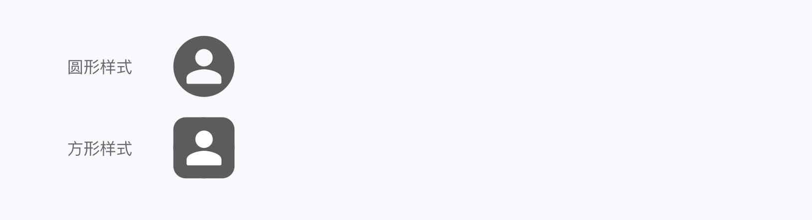
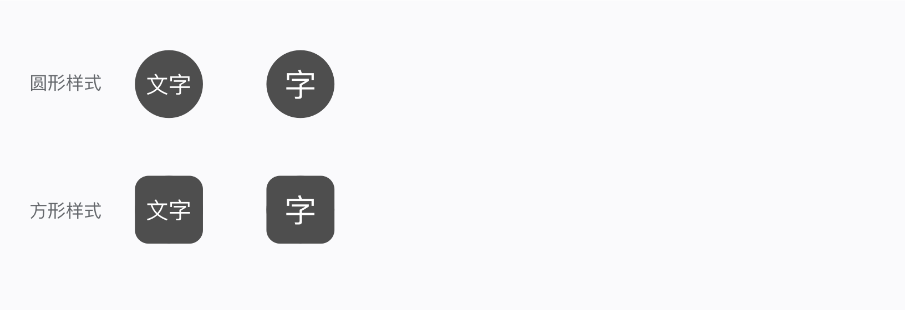

## 用法
- 用于标记对象的部分属性和信息

## 常规头像

1. 头像的展示样式一般有圆形或者方形两种
1. 头像支持点击，一般作为编辑个信信息入口

## **文字头像** 
在使用文字作为头像时，最多 2 个字符。在整体颜色搭配视觉感官舒适的基础上底色可根据头像颜色自定义。 

## 实例
<code src="./example.tsx" />

## API

## 主题变量

undefined

