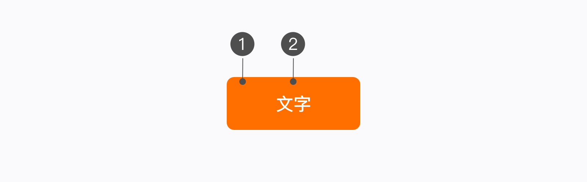
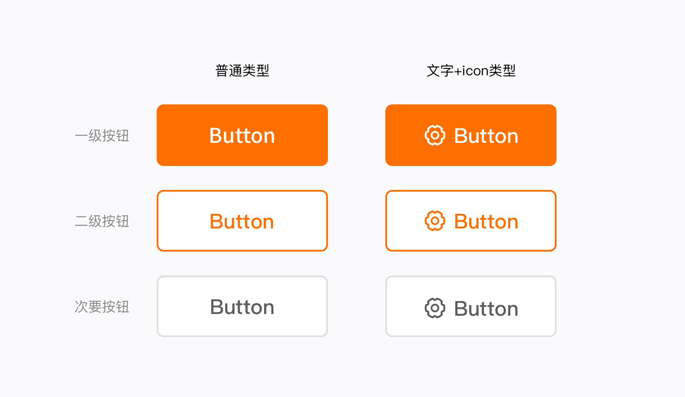
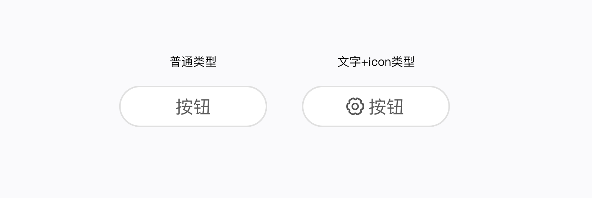
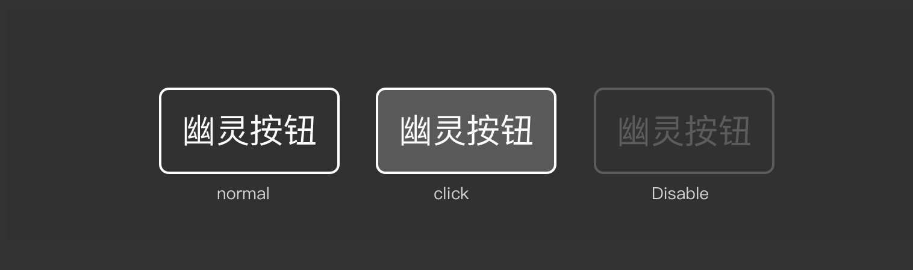

## 简介
按钮是一个可以被点击的且用于执行某项操作的单击项。

## 用法

- 提交、编辑、开始一项新的任务；
- 触发一个新的 UI 元素；
- 指定流程中新的步骤和下一步。

如果当前操作十分重要，请使用主要按钮，如果当前页面操作，无法评是否重要，可选择使用次按钮，一个页面最多只出现一个主按钮操作，按钮按照重要程度依次为：主要按钮 > 次要按钮。

## 结构

- 按钮主要由容器、文字组成
- 为了增加按钮辨识与视觉生动性，必要时可添加图标搭配文字一起使用。

       按钮主要由容器、文字组成 

1. 按钮容器：必选项，容器必须包含文字和icon的一种来使用
1. 文字内容：用来表达信息内容，语言需要准确简练，必选项

## 样式

#### 1、常规按钮

- 按钮分为主要、二级、次要三个层次，按钮尺寸：定高 120px / 96px  / 84px / 72px / 56px / 48px 。
- 业务中根据实际操作的重要程度使用，一级按钮在同一操作区域最多出现一次；其重要程度排序依次为：一级按钮 > 二级按钮 > 次要按钮。

#### 2、腰圆按钮

- 页面中为了对按钮进行区分，也可搭配不同样式按钮使用，腰圆按钮通常在页面右上角作为操作入口。

#### 3、文字按钮

- 文字按钮仅由文本组成
- 文字按钮的视觉层级是最低的，常用于表格内操作按钮、关联页面或任务重量最次级的操作
- 带icon样式的文字按钮，icon与文字大小保持一致，如文字尺寸24px，icon尺寸使用24

#### 4、幽灵按钮

- 幽灵按钮是一种容器有边框没有填充色的按钮，主要用在深色背景和图片上

## 

## 实例
<code src="./example.tsx" />

## API

## 主题变量

undefined

